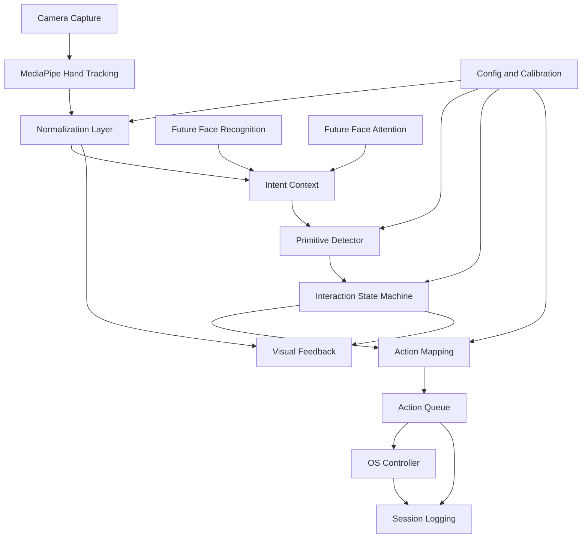
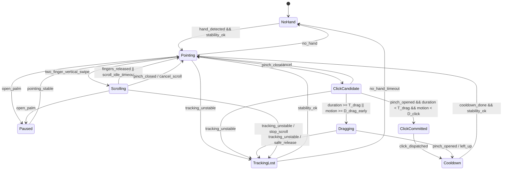

# Touchless Control MVP Design

## Architecture Overview

Responsibilities:
- Camera capture reads frames and keeps timestamps fresh.
- Perception emits one-hand landmarks, handedness, and confidence values.
- Normalization computes palm scale, normalized landmark positions, pinch ratio, hand velocity, finger count, and stability.
- Intent context is the multimodal boundary that can carry hand features now and face/attention signals later.
- Primitive detection emits candidate events only; it never dispatches OS input.
- Interaction state machine owns commit/cancel/cooldown rules.
- Action mapping converts interaction decisions into `ActionCommand`.
- OS controller dispatches commands through Windows or Linux backends.
- Overlay and logging expose state, latency, action outcomes, and errors.
- Configuration and calibration provide threshold, smoothing, sensitivity, and user-specific tuning values.

The runtime must favor latest-frame freshness over exhaustive frame processing. Camera/perception may drop stale frames when downstream processing is busy; interaction and OS dispatch must never process an unbounded backlog of old hand positions.

## Interaction State Model
Scroll is represented as a dedicated `Scrolling` state. This makes continuous wheel dispatch, cancellation, overlay feedback, and logging explicit instead of hiding scroll inside `Pointing`.

Scroll lifecycle:
- Enter `Scrolling` only from stable `Pointing` when `two_finger_ready` and vertical swipe direction are both confident.
- Emit wheel commands at a bounded interval while the state remains active.
- Stop scroll on finger release, idle timeout, open palm, pinch conflict, drag conflict, or tracking loss.
- Log scroll start, repeated wheel dispatch, stop reason, direction, latency, and any cancellation.
- Overlay must show `Scrolling` within one rendered frame of state entry.

## Data Models
Core contracts:
- `HandFrame`: timestamp, frame size, image landmarks, world landmarks, handedness, detection confidence, presence confidence, tracking confidence.
- `FeatureFrame`: hand presence, stability score, palm scale, palm/index/thumb/middle normalized positions, index direction, hand velocity, pinch ratio, pinch center, finger count, two-finger readiness, open palm, tracking lost.
- `FaceFrame`: future face presence, normalized face box, optional identity id, detection confidence, and tracking confidence.
- `AttentionFrame`: future face-attention estimate, gaze vector, confidence, and whether attention is on screen.
- `IntentSignal`: generic explainable signal for future intent models.
- `IntentContext`: multimodal runtime input containing optional hand, face, attention, and intent-signal values.
- `PrimitiveEvent`: timestamp, type, confidence, source features.
- `InteractionEvent`: timestamp, previous state, new state, reason, confidence, elapsed time.
- `ActionCommand`: timestamp, type, movement delta or wheel delta, source state.
- `OSDispatchResult`: timestamp, command type, success, backend, error code, dispatch latency.
- `SensitivityPreset`: pointer gain, acceleration gain, deadzone, smoothing coefficients, drag hold threshold, and scroll interval.
- `CalibrationProfile`: palm-scale baseline, jitter estimate, pinch close/open ratios, click motion guard, drag motion threshold, timestamp, and source preset.

The state machine must treat contracts as immutable per frame. Components may derive new events and commands, but they must not mutate the original `HandFrame` or `FeatureFrame`.

## API Design
Internal interfaces:
- `Perception.submit(frame, timestamp_ms) -> None`
- `Perception.poll_latest() -> HandFrame | None`
- `Normalizer.to_features(hand_frame) -> FeatureFrame`
- `PrimitiveDetector.detect(feature_frame) -> list[PrimitiveEvent]`
- `InteractionStateMachine.step(feature_frame, primitive_events) -> list[InteractionEvent | ActionCommand]`
- `TouchlessPipeline.step_context(intent_context) -> tuple[ActionCommand, ...]`
- `CursorMapper.map_motion(feature_frame) -> ActionCommand`
- `MouseController.dispatch(action_command) -> OSDispatchResult`
- `SessionLogger.record(feature_frame, events, commands, results) -> None`
- `CalibrationService.update(samples) -> CalibrationProfile`
- `ConfigStore.load() -> SensitivityPreset | CalibrationProfile`
- `ConfigStore.save(profile) -> None`

External APIs:
- Windows: `SendInput` with relative movement, left button down/up, and wheel events.
- Linux: `uinput` virtual device with `EV_REL/REL_X/REL_Y`, `EV_KEY/BTN_LEFT`, `REL_WHEEL`, and `SYN_REPORT`.

## Component Breakdown
- `perception`: camera and MediaPipe integration.
- `features`: normalization, stability, palm scale, velocity, pinch metrics.
- `runtime`: multimodal intent-context orchestration and safety gating.
- `interaction`: primitives, state machine, safety policy, cooldowns.
- `control`: action mapping, action queue, OS controller interface, Windows backend, Linux backend.
- `presentation`: overlay, camera/debug view, status indicators.
- `observability`: structured session logs, summary metrics, failure taxonomy.
- `config`: sensitivity presets, calibration result persistence.

Package layout:
- `core`: shared contracts and configuration.
- `vision`: camera capture, hand perception/features, and reserved face/attention model packages.
- `intent`: multimodal intent policy and future intent-model helpers.
- `interaction`: hand primitive detection and interaction state machine.
- `control`: cursor mapping, action queue, and OS-specific mouse backends.
- `runtime`: application pipeline orchestration.
- `presentation`: overlay/status data.
- `observability`: logging, metrics, and acceptance checks.

## Design Decisions
- Use state-machine interaction instead of direct gesture-to-OS dispatch because false positives are more costly than missed actions.
- Commit click on pinch release, not pinch close, to avoid accidental micro-drags.
- Treat click and drag as outcomes of the same pinch candidate.
- Model scroll as a dedicated `Scrolling` state rather than a stateless `Pointing` action.
- Use relative mapping because it avoids screen-space calibration fragility.
- Use latest-frame freshness over processing every frame to avoid input lag.
- Keep one-hand MVP to avoid arbitration complexity.
- Keep face recognition and face-attention as optional context inputs, not hard dependencies of the hand state machine.
- Gate committed hand actions at the runtime intent-context boundary when future attention signals say the user is not attending to the screen.
- Do not use the removed reference repositories as architecture baselines; they were exploratory only.

Alternatives considered:
- Absolute mapping: simpler demo behavior but brittle near camera edges and screen bounds.
- Direct primitive dispatch: faster to prototype but unsafe for real input-device behavior.
- Stateless scroll from `Pointing`: lower complexity but weaker cancellation, feedback, and logging semantics.
- Custom model training: unnecessary before logging failure cases from a rule-based MVP.

## Requirements Coverage
| Requirement area | Design coverage |
|---|---|
| Cursor movement | `FeatureFrame`, `CursorMapper`, relative `ActionCommand`, deadzone/smoothing/gain configuration |
| Left click | `ClickCandidate`, release-time `ClickCommitted`, cooldown, OS controller click command |
| Drag | shared pinch candidate, `Dragging`, hold and motion thresholds, safe release |
| Scroll | dedicated `Scrolling` state, bounded wheel dispatch, explicit cancellation paths |
| Pause/clutch | `Paused` state blocks committed actions and resumes only after stable pointing |
| Feedback | `Overlay` consumes state and normalized features |
| Logging | `SessionLogger` records features, events, commands, dispatch results, reasons, and latency |
| Calibration/config | `SensitivityPreset`, `CalibrationProfile`, config store, calibration service |
| Windows/Linux support | common `MouseController` interface with independent backends |
| Safety | primitive detector cannot dispatch OS input; state machine owns commit/cancel/cooldown |
| Future face/attention intent | `FaceFrame`, `AttentionFrame`, `IntentSignal`, and `IntentContext` allow future models to gate or explain hand actions without rewriting hand primitives |

## Non-Functional Requirements
- p95 end-to-end latency under 80 ms.
- Effective processing rate at least 30 FPS; target 45 FPS.
- No blocking OS dispatch on camera capture or perception.
- Safe release on tracking loss for any state that holds mouse-down or continuous scroll.
- Structured logs must be sufficient to replay state transitions and explain committed actions.
- Windows/Linux backends must be isolated behind the same controller interface.
- Action queue must be bounded and must drop or coalesce stale movement commands instead of increasing input latency.
- `Scrolling`, `Dragging`, and `Paused` transitions must include explicit log reasons for auditability.

## Remaining Design Assumptions
- The dedicated `Scrolling` state is approved for MVP.
- Exact Python package names can be finalized during implementation planning as long as the component boundaries above remain intact.
- The first implementation may use mocked OS backends for automated tests before enabling real `SendInput` and `uinput` dispatch.
