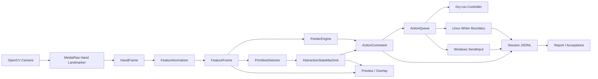
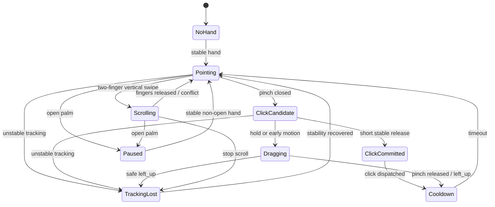

# Cách tiếp cận hiện tại của Touchless Control

## Overview

Touchless Control được xây dựng như một **thiết bị nhập liệu thời gian thực có trạng thái**, không phải một bộ phân loại gesture độc lập theo từng frame. Hệ thống biến chuyển động một bàn tay trước webcam thành con trỏ tương đối, click trái, drag, scroll và pause/clutch.

Ưu tiên thiết kế là:

1. An toàn trước: bỏ lỡ thao tác tốt hơn phát sinh click/drag sai hoặc kẹt mouse-down.
2. Dữ liệu mới trước: xử lý kết quả tracking mới nhất thay vì tích lũy hàng đợi frame cũ.
3. Tách ý định khỏi chuyển động: state machine quyết định người dùng muốn làm gì; pointer engine quyết định con trỏ dịch bao nhiêu pixel.
4. Đo được chất lượng: preview, JSONL log, report và acceptance gate là thành phần của runtime, không phải công cụ bổ sung bên ngoài.

Entry point chính là [`main.py`](../../../main.py). Luồng camera trực tiếp được điều phối bởi [`LiveRunner`](../../../touchless_control/runtime/live.py), còn logic interaction được gom trong [`TouchlessPipeline`](../../../touchless_control/runtime/pipeline.py).

## Implementation Details

### 1. CLI và runtime orchestration

`main.py` cung cấp bốn command:

- `camera-smoke`: xác nhận camera và MediaPipe có thể khởi tạo, đọc frame.
- `camera-snapshot`: chụp một frame để kiểm tra nguồn camera, ánh sáng và framing.
- `live`: chạy pipeline hoàn chỉnh ở chế độ dry-run hoặc OS dispatch thật.
- `report`: phân tích một session JSONL sau khi chạy.

`LiveRunner.run()` thực hiện vòng lặp:

1. Mở camera và cấu hình width, height, FPS, buffer.
2. Khởi tạo MediaPipe perception và mouse controller.
3. Đọc frame mới, gắn timestamp rồi gửi vào detector bất đồng bộ.
4. Poll kết quả hand tracking mới nhất.
5. Loại bỏ kết quả có timestamp cũ hoặc trùng.
6. Chuẩn hóa landmarks thành feature.
7. Chạy interaction pipeline, enqueue và dispatch command.
8. Ghi JSONL, cập nhật overlay và preview.
9. Giải phóng camera/preview và trả về session summary.

Runtime mặc định dùng capture 640×480, yêu cầu camera 60 FPS, buffer size 1, preview 960×720, preset `responsive`, đảo trục X, gain scale 1.25 và poll timeout 20 ms.

### 2. Perception và freshness

[`MediaPipeHandPerception`](../../../touchless_control/vision/hands/mediapipe.py) dùng MediaPipe Hand Landmarker cho tối đa một bàn tay. Kết quả perception được chuyển thành `HandFrame`, gồm landmarks ảnh/world, handedness và các confidence score.

Runtime áp dụng chiến lược **latest-frame wins**:

- Không xây hàng đợi vô hạn các vị trí tay cũ.
- Kết quả đã được poll sẽ được tiêu thụ.
- `LiveRunner` tiếp tục chặn timestamp không tăng.
- Camera buffer được yêu cầu giữ ở mức 1 khi backend hỗ trợ.

Cách này giảm độ trễ tích lũy và tránh cursor tiếp tục chạy theo một kết quả MediaPipe stale.

### 3. Feature normalization

[`FeatureNormalizer`](../../../touchless_control/vision/hands/features.py) chuyển `HandFrame` thành `FeatureFrame`. Các feature chính gồm:

- Stability score từ detection, presence và tracking confidence thấp nhất.
- Tâm và kích thước lòng bàn tay.
- Vận tốc tâm bàn tay.
- Vị trí ngón cái, ngón trỏ và ngón giữa.
- Pinch ratio được chuẩn hóa theo palm scale.
- Số ngón đang giơ.
- `two_finger_ready`, `open_palm` và `tracking_lost`.

Con trỏ hiện được điều khiển chủ yếu bằng **tâm lòng bàn tay**, không bám tuyệt đối vào đầu ngón trỏ. Việc chuẩn hóa theo palm scale giúp threshold ít phụ thuộc vào khoảng cách người dùng tới camera.

### 4. Primitive detection

[`PrimitiveDetector`](../../../touchless_control/interaction/primitives.py) chỉ phát hiện tín hiệu mức thấp:

- `pointing`
- `pinch_closed`
- `pinch_opened`
- `open_palm`
- `two_finger_swipe`
- `tracking_lost`

Pinch sử dụng hysteresis: một ngưỡng để đóng và một ngưỡng lớn hơn để mở lại. Scroll chỉ được phát khi không pinch, ngón trỏ và giữa đang giơ, chuyển động dọc đủ lớn và trội hơn chuyển động ngang.

Primitive detector không trực tiếp tạo click hoặc drag. Nó cung cấp bằng chứng theo frame để state machine quyết định ý định theo thời gian.

### 5. Interaction state machine

[`InteractionStateMachine`](../../../touchless_control/interaction/state_machine.py) quản lý các trạng thái:

```text
NoHand
Pointing
ClickCandidate
ClickCommitted
Dragging
Scrolling
Paused
TrackingLost
Cooldown
```

Quy tắc chính:

- Click: pinch đóng → `ClickCandidate` → thả nhanh, chuyển động nhỏ → `left_click`.
- Drag: giữ pinch đủ lâu hoặc di chuyển đủ xa → `Dragging` + `left_down`; thả pinch → `left_up`.
- Scroll: two-finger vertical swipe → `Scrolling` + wheel command có giới hạn tần suất.
- Pause: open palm → `Paused`; chặn movement, click, drag và scroll.
- Tracking loss: chuyển sang `TrackingLost`; nếu đang drag thì phát `left_up` an toàn.
- Cooldown: ngăn một lần pinch bị commit thành nhiều click liên tiếp.

Preset live mặc định là `responsive`, với drag hold khoảng 240 ms. Vì click và drag dùng chung pinch candidate, độ ổn định của tâm pinch và thời gian giữ pinch quyết định kết quả cuối cùng.

### 6. Pointer engine

[`PointerEngine`](../../../touchless_control/control/pointer_engine.py) xử lý chuyển động riêng với gesture state machine. Movement chỉ được phát khi state là `Pointing` hoặc `Dragging`.

Cơ chế hiện tại gồm:

- Relative movement thay vì ánh xạ tuyệt đối vào màn hình.
- Kết hợp position delta và velocity; tốc độ thấp ưu tiên position, tốc độ cao ưu tiên velocity.
- Virtual trackpad bounds giới hạn vùng tay hiệu lực.
- EMA smoothing thay đổi theo tốc độ.
- Gain curve phi tuyến, gain scale và đảo trục camera.
- Clamp bước dịch chuyển cực đại.
- Residual accumulation để phần pixel lẻ không bị mất.
- Adaptive deadzone tăng khi tay đứng yên và giảm khi chuyển động.
- Cộng dồn dịch chuyển nhỏ cùng hướng để đánh thức slow motion.
- Giữ motion qua tối đa hai quiet frame bằng vận tốc giảm theo hệ số 0.55.
- Dừng và reset về stationary gate ở quiet frame thứ ba.

Mục tiêu là giữ stationary jitter thấp mà không làm mất chuyển động chậm có chủ đích.

### 7. Queue và OS dispatch

[`ActionQueue`](../../../touchless_control/control/queue.py) là biên an toàn trước hệ điều hành:

- Giới hạn tối đa 64 command.
- Coalesce movement chưa dispatch, chỉ giữ movement mới nhất.
- Giữ thứ tự button down/up.
- Theo dõi trạng thái nút trái để hỗ trợ safe release.
- Bỏ command `none`.

Controller backend:

- `--dry-run`: dùng no-op controller, vẫn tạo dispatch result nhưng không tác động OS.
- Windows: dùng relative `SendInput`.
- Linux: đã có controller/payload abstraction nhưng runtime factory vẫn yêu cầu writer được inject; `/dev/uinput` chưa phải đường chạy end-user hoàn chỉnh.

### 8. Observability và acceptance

[`SessionLogger`](../../../touchless_control/observability/logger.py) ghi một JSONL record cho mỗi hand frame mới, gồm:

- Timestamp, state và normalized features.
- Primitive và lý do chuyển state.
- Action command và cursor delta.
- Dispatch success/error code.
- End-to-end latency.
- Scenario label.

Preview hiển thị landmarks, state, action, FPS, cursor update rate, movement coverage, p95 movement gap, camera read drop, stale frame và calibration status.

`report` tổng hợp latency, FPS, action/primitive distribution, tracking loss, dispatch failure, movement coverage/gap/freeze và stationary jitter. [`AcceptanceEvaluator`](../../../touchless_control/observability/acceptance.py) áp dụng các ngưỡng:

- p95 latency ≤ 80 ms.
- Effective tracking FPS ≥ 30.
- Movement coverage ≥ 80%.
- p95 movement gap ≤ 50 ms.
- Maximum active-movement freeze ≤ 150 ms.
- Stationary jitter ≤ 6 px RMS.
- Dispatch failure bằng 0.

## Dependencies

### Internal dependencies — depth 1

- `main.py` → camera runners, `LiveRunner`, session report.
- `LiveRunner` → capture, perception, normalizer, pipeline, controller, overlay, logger.
- `TouchlessPipeline` → primitive detector, state machine, pointer engine, action queue.

### Internal dependencies — depth 2

- Perception → MediaPipe detector factory và core hand contracts.
- Primitive detector/state machine → `FeatureFrame`, `PrimitiveEvent`, `InteractionEvent`, `ActionCommand`.
- Pointer engine → `PointerConfig`, sensitivity preset và optional pointer calibration profile.
- Action queue → abstract `MouseController` và `OSDispatchResult`.

### Internal dependencies — depth 3

- Windows controller → `SendInput` sender.
- Linux controller → injected uinput-style writer.
- Preview → OpenCV drawing và overlay snapshot.
- Report → JSONL entries, scenario-aware metrics và acceptance thresholds.

### External dependencies

- Python 3.12 runtime qua `uv`.
- OpenCV cho camera capture và preview.
- MediaPipe Tasks cho hand landmarks.
- Windows `SendInput` cho OS injection trên Windows.

Không có dịch vụ mạng hoặc backend server trong luồng runtime chính; camera frame và input dispatch ở lại máy cục bộ.

## Visual Diagrams

### End-to-end data flow



### Interaction lifecycle



## Additional Insights

### Điểm mạnh

- Perception, intent, pointer mapping và OS dispatch có ranh giới rõ.
- State machine tránh dispatch trực tiếp từ một gesture frame đơn lẻ.
- Có pause, cooldown và safe release khi tracking loss.
- Latest-frame processing ngăn latency tích lũy.
- Dry-run cho phép kiểm thử toàn pipeline mà không điều khiển chuột thật.
- Pointer engine xử lý residual, jitter và slow-motion tốt hơn cursor mapper ban đầu.
- JSONL tạo bằng chứng có thể replay và đo định lượng.

### Rủi ro và giới hạn hiện tại

- `pointing` hiện đồng nghĩa với stable hand, chưa bắt buộc tư thế một ngón rõ ràng; primitive có thể chồng lấn với open palm hoặc two-finger readiness.
- Click/drag nhạy với thời gian pinch và chuyển động tâm pinch; log manual gần nhất có nhiều drag và click candidate bị hủy.
- Camera thực tế xấp xỉ 30 FPS; một movement frame bị bỏ có thể tạo gap khoảng 60–70 ms, vượt gate 50 ms.
- Calibration service/profile đã tồn tại nhưng `LiveRunner` vẫn tạo pointer config trực tiếp từ preset và báo `uncalibrated`.
- Windows elevated `SendInput` còn blocker; Linux `/dev/uinput` chưa được nối hoàn chỉnh.
- Face/attention mới là extension point; live runtime hiện vẫn hand-only.
- Manual acceptance matrix chưa hoàn tất.

### Acceptance snapshot ngày 2026-08-31

- `move-straight`: coverage 92% và latency 10 ms đạt; FPS 29.35, p95 gap 62 ms và freeze 407 ms chưa đạt.
- `move-slow-precise`: coverage 88% và latency 10 ms đạt; FPS 29.92, p95 gap 60 ms và freeze 740 ms chưa đạt.
- `move-stationary`: jitter 4.0 px RMS đạt, nhưng run chỉ dài 4.53 giây và chưa đủ protocol 10 lần.
- `click-intent`: 39 click, 54 drag và 416 pinch candidate bị hủy; chưa đạt click stability.
- `real-dispatch-normal`: 402/402 dispatch API thành công, không có failure hoặc stuck mouse-down trong log.

## Metadata

- Ngày phân tích: 2026-08-31.
- Source revision: `595d34c`.
- Entry point: `main.py`.
- Analysis depth: 3.
- Ngôn ngữ/runtime: Python 3.12.
- Files created by this documentation task: 1.
- Code files modified: 0.

## Next Steps

- [ ] Giảm gesture overlap và cải thiện click/drag disambiguation từ log manual.
- [ ] Đạt p95 movement gap ≤ 50 ms và freeze ≤ 150 ms trong fresh camera runs.
- [ ] Hoàn tất 10 stationary repetitions và full click/drag/scroll/pause/tracking-loss matrix.
- [ ] Nối persistence/loading của pointer calibration profile vào live runtime.
- [ ] Sửa và xác nhận elevated Windows dispatch.
- [ ] Hoàn thiện Linux `/dev/uinput` writer và cross-OS acceptance.
- [ ] Chỉ đánh dấu product-ready sau khi acceptance gate và manual E2E cùng đạt.
