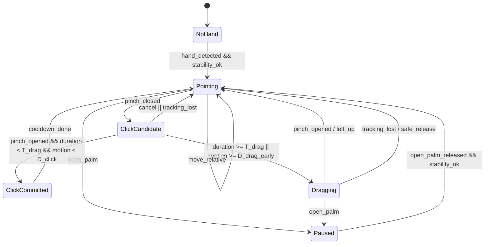

# Đặc tả yêu cầu phần mềm cho hệ thống điều khiển chuột bằng cử chỉ tay

## Tóm tắt điều hành

Tài liệu này chuyển hóa spec kỹ thuật hiện tại thành một **Software Requirements Specification** có thể giao cho team phát triển, QA và reviewer dùng chung như tài liệu chuẩn hóa yêu cầu. Điểm xuất phát của hệ thống vẫn giữ đúng tinh thần spec gốc: đây là một **input device không chạm dựa trên camera**, không phải một bài toán phân loại gesture độc lập theo kiểu “mỗi frame ra một nhãn”. Trục thiết kế đúng là **theo dõi tay liên tục → suy luận trạng thái tương tác → phát mouse event an toàn vào hệ điều hành**, với state machine, safety policy, feedback và logging là trung tâm. fileciteturn0file0

Phiên bản SRS này chuẩn hóa các quyết định đã được chốt: gesture cuộn là **two-finger vertical swipe**, mapping là **relative**, hệ điều hành mục tiêu là **Windows và Linux**, **không xét multi-hand trong MVP**, và mục tiêu độ trễ đầu-cuối là **dưới 80 ms**. Những điểm này phù hợp với khả năng của MediaPipe Hand Landmarker trong việc xuất landmarks, handedness và tracking theo luồng live stream, đồng thời phù hợp với cơ chế phát sự kiện chuột ở Windows qua `SendInput` và ở Linux qua `uinput`. citeturn4view2turn18view2turn4view3turn4view5turn9view0

Về mặt nghiên cứu, ba kết luận chi phối bản SRS này là: thứ nhất, hand tracking thời gian thực hiện nay đã đủ chín để làm perception baseline bằng MediaPipe mà chưa cần train model ở MVP; thứ hai, hệ thống mid-air có rủi ro lớn về rung, che khuất, motion blur và false trigger nên phải có hysteresis, threshold và safe state; thứ ba, với input injection ở OS, sai hành động nguy hiểm hơn bỏ sót hành động, vì một false click/false drag phá hỏng trải nghiệm nhanh hơn nhiều so với một missed click. Các kết luận này được hậu thuẫn bởi tài liệu chính thức của MediaPipe và các nghiên cứu gần đây về robust hand pose estimation, liên tục chỉ ra rằng occlusion, illumination variation và motion blur là những điểm yếu chính của hệ thống vision-based hand interaction. citeturn2academia2turn2academia1turn2academia4turn11academia3turn14academia0

Khuyến nghị cốt lõi của SRS này là: dùng **state machine 5 trạng thái chính** cho interaction (`Pointing`, `ClickCandidate`, `ClickCommitted`, `Dragging`, `Paused`), cộng với safe states phụ như `NoHand`, `TrackingLost`, `Cooldown`; dùng **pinch ngắn để click**, **pinch giữ để drag**, nhưng **không commit drag ngay khi pinch vừa đóng**; thay vào đó, hệ thống phải dùng ngưỡng thời gian và hysteresis khoảng cách để phân biệt click với drag. Mặc định được khuyến nghị trong bản này là: `pinch_close_ratio <= 0.30`, `pinch_open_ratio >= 0.45`, `drag_hold_threshold = 280 ms`, `early_drag_motion_threshold = 0.12` theo đơn vị palm-scale chuẩn hóa, và `click_motion_guard = 0.04` palm-scale. Các giá trị này không phải “sự thật khách quan duy nhất”, mà là **giá trị SRS đề xuất** để tối ưu cân bằng giữa false drag, false click và latency trong bối cảnh interactive hand tracking không có bề mặt vật lý. citeturn10view0turn19academia0turn2academia1turn18view2turn14academia0

## Cơ sở nghiên cứu và các quyết định chuẩn hóa

MediaPipe Hand Landmarker là một lựa chọn perception phù hợp cho MVP vì nó nhận dữ liệu ảnh tĩnh, video hoặc live stream; xuất ra landmarks trong image coordinates, world coordinates và handedness; hỗ trợ cấu hình `num_hands`; đồng thời trong chế độ `LIVE_STREAM` nó trả kết quả bất đồng bộ qua callback và dùng tracking giữa các frame để giảm số lần phải chạy palm detector, nhờ đó giảm độ trễ. Tài liệu chính thức của Google cũng nêu benchmark tham khảo cho toàn pipeline của model full trên Pixel 6 là khoảng **17.12 ms CPU** và **12.27 ms GPU**, cho thấy về nguyên lý perception stage có thể nằm vừa ngân sách thời gian của hệ thống nếu pipeline còn lại được giữ gọn và không block. citeturn18view2turn4view2turn4view0

Vì sao vẫn cần **ngưỡng click-vs-drag**, dù drag được định nghĩa là “pinch sustained”? Cốt lõi là ở chỗ hệ thống vision-based không nhìn thấy “tiếp xúc vật lý” như touchpad thật. Nó chỉ quan sát một loạt frame có landmarks bị nhiễu, có thể rung nhẹ, trễ, hoặc mất ổn định khi che khuất và motion blur. Nếu hệ thống phát `mouse down` ngay khi pinch vừa đóng, thì một click bình thường rất dễ bị biến thành **micro-drag không chủ ý**, vì con trỏ vẫn đang di chuyển một ít do jitter hoặc quán tính tay trong lúc nút đã được giữ xuống. Nghiên cứu về robustness của hand pose estimation cho thấy motion blur, occlusion và ánh sáng xấu đều có thể làm giảm đáng kể chất lượng tracking; spec gốc của dự án cũng đã chỉ ra camera không có ma sát, không có cảm giác chạm và rất dễ rung tay, nên requirement đúng phải tách rõ **candidate state** khỏi **commit state**. citeturn2academia1turn2academia4turn11academia3turn19academia0turn14academia0turn10view0turn0file0

Nói cách khác, threshold không phải để “phân loại gesture cho đẹp”, mà để quyết định **thời điểm hợp pháp** hệ thống được phép phát sự kiện OS. Click là hành động nhịp ngắn, thường được commit khi pinch đã đóng rồi mở ra trong một khoảng ngắn và gần như không có dịch chuyển đáng kể; drag là hành động có tính giữ-nhấn, nên hệ thống chỉ được phát `left-down` khi có đủ bằng chứng rằng người dùng muốn kéo, thay vì chỉ muốn click. Đây là một quyết định HCI và safety nhiều hơn là CV thuần túy. citeturn4view3turn7view1turn19academia0turn14academia0

Bảng dưới đây so sánh các phương án ngưỡng đề xuất cho SRS. Đây là **đề xuất kỹ thuật của tài liệu này**, được xây từ ràng buộc `latency < 80 ms`, đặc tính tracking/async của MediaPipe, và yêu cầu giảm false positive của spec gốc; chúng không phải là ngưỡng “mặc định” do MediaPipe hay OS cung cấp. citeturn18view2turn4view0turn0file0

| Hồ sơ ngưỡng | `drag_hold_threshold` | `click_motion_guard` | `early_drag_motion_threshold` | Ưu điểm | Nhược điểm | Khi nên dùng |
|---|---:|---:|---:|---|---|---|
| Nhanh | 220 ms | 0.03 palm-scale | 0.09 palm-scale | Drag vào nhanh, cảm giác “nhạy” | Dễ false drag hơn khi tay rung | Người dùng đã quen hệ thống |
| Cân bằng | 280 ms | 0.04 palm-scale | 0.12 palm-scale | Cân bằng tốt giữa click và drag | Drag có cảm giác trễ nhẹ với người rất nhanh tay | **Mặc định đề xuất** |
| Bảo thủ | 350 ms | 0.05 palm-scale | 0.15 palm-scale | Giảm false drag mạnh | Drag chậm, click dài dễ thành missed click | Demo công cộng, môi trường nhiễu |

Khuyến nghị mặc định của SRS là hồ sơ **Cân bằng**: `drag_hold_threshold = 280 ms`, `pinch_close_ratio <= 0.30`, `pinch_open_ratio >= 0.45`, `click_motion_guard = 0.04`, `early_drag_motion_threshold = 0.12`. Lý do là ngưỡng này đủ dài để hấp thụ rung ngắn và transient false pinch, nhưng chưa dài tới mức drag trở nên khó chịu. Khoảng cách close/open dùng kiểu **hysteresis** để tránh trạng thái pinch đóng–mở–đóng liên tục do nhiễu. Ngưỡng motion được chuẩn hóa theo kích thước bàn tay nhằm giảm phụ thuộc vào khoảng cách tay tới camera. citeturn4view0turn18view2turn2academia1turn19academia0

Hệ thống cũng nên hỗ trợ ba mức sensitivity cho người dùng cuối. Ở mức **Low Sensitivity**, gain con trỏ thấp hơn, smoothing mạnh hơn, `drag_hold_threshold` dài hơn; ở mức **Medium**, dùng đúng mặc định đề xuất; ở mức **High**, giảm smoothing và rút ngắn threshold để thao tác nhanh hơn. Điều này là cần thiết vì `SendInput` ở Windows xử lý relative movement theo pixel và còn chịu ảnh hưởng của mouse speed / threshold của hệ thống, nên cảm giác điều khiển thực tế không hoàn toàn độc lập với cấu hình máy người dùng. citeturn10view0turn7view1

Với **relative mapping**, hệ thống không ánh xạ trực tiếp vị trí tay vào vị trí màn hình, mà ánh xạ **dịch chuyển tay đã được chuẩn hóa** thành `Δx`, `Δy` của con trỏ. Đây là quyết định phù hợp với spec gốc vì relative mapping chịu lỗi calibration ít hơn và “tự nhiên” hơn trong môi trường mid-air, dù nó đòi hỏi clutch/recenter. Về mặt OS, lựa chọn này cũng ăn khớp với cả Windows `MOUSEINPUT` relative mode lẫn Linux `uinput` với `EV_REL / REL_X / REL_Y`. fileciteturn0file0 citeturn10view0turn7view3turn7view4

Hàm mapping được khuyến nghị là:

```text
p_t = vị trí đầu ngón trỏ đã chuẩn hóa theo palm-scale
v_t = p_t - p_(t-1)

nếu ||v_t|| < deadzone  ->  0
ngược lại:
    v'_t = filter(v_t)
    gain_t = base_gain + accel_gain * min(||v'_t|| / v_ref, 1)^gamma
    Δcursor_t = clamp(screen_scale * gain_t * v'_t, max_step)
```

Trong đó, `filter(v_t)` có thể là một trong ba lựa chọn. **EMA trên delta** là baseline rẻ và dễ tune; **EMA thích ứng theo vận tốc** là mặc định khuyến nghị vì khi tay đi chậm hệ thống cần mượt, nhưng khi tay đi nhanh hệ thống cần giảm lag; **Kalman filter vận tốc hằng** có thể dùng khi perception nhiễu hơn, vì đã có nghiên cứu trước đó dùng Kalman để ổn định hand-based cursor control trong real time. Bất kể filter nào, hệ thống phải có **deadzone** để triệt rung vi mô khi người dùng cố giữ tay đứng yên. citeturn19academia0turn2academia1turn10view0

Bảng dưới đây là cấu hình mapping/smoothing đề xuất ở mức SRS:

| Tham số | Mặc định đề xuất | Ý nghĩa |
|---|---:|---|
| `deadzone` | 0.015 palm-scale | Bỏ qua chuyển động quá nhỏ để chống jitter |
| `base_gain` | 900 px / palm-scale | Gain cơ sở cho di chuyển chậm |
| `accel_gain` | 1600 px / palm-scale | Gain tăng thêm theo tốc độ |
| `v_ref` | 0.10 palm-scale / frame | Tốc độ tham chiếu để tăng gain |
| `gamma` | 1.6 | Độ cong của hàm tăng tốc |
| `ema_alpha_slow` | 0.22 | Smoothing khi tốc độ thấp |
| `ema_alpha_fast` | 0.55 | Smoothing khi tốc độ cao |
| `max_step` | 120 px / frame | Chặn spike do tracking lỗi |

Quy trình **calibration** nên diễn ra trong khoảng 20–30 giây khi người dùng chạy hệ thống lần đầu. Hệ thống yêu cầu người dùng giữ tư thế pointing yên 2 giây để đo jitter nền và palm-scale, sau đó thực hiện 10 pinch ngắn và 5 pinch giữ để ước lượng phân bố thời lượng pinch và tỷ lệ đóng/ngắt của pinch. Từ đó, SRS khuyến nghị hiệu chỉnh như sau: `pinch_close_ratio = min(0.30, P80(closed_ratio)+0.03)`, `pinch_open_ratio = max(pinch_close_ratio+0.10, P20(open_ratio)-0.03)`, `drag_hold_threshold = clamp(P90(short_pinch_duration)+60 ms, 220 ms, 320 ms)`, `click_motion_guard = max(0.04, 2σ_jitter_norm)`, `early_drag_motion_threshold = max(0.12, 4σ_jitter_norm)`. Cách này giúp ngưỡng thích ứng theo từng người nhưng vẫn không trượt khỏi biên an toàn của hệ thống. citeturn2academia1turn11academia3turn14academia0

Biểu đồ dưới đây là **ngân sách độ trễ đề xuất** để đạt mục tiêu `< 80 ms`. Con số MediaPipe benchmark không được hiểu là cam kết desktop thực tế, nhưng đủ để chứng minh perception stage có thể nằm trong ngân sách nếu pipeline còn lại không block và nếu live stream mode được dùng đúng cách. citeturn4view0turn18view2

```mermaid
gantt
    title Ngân sách độ trễ gesture-to-event đề xuất
    dateFormat  X
    axisFormat %L ms

    section Perception
    Chụp frame và copy buffer           :0, 12
    Hand tracking và landmarks          :12, 32
    Chuẩn hóa và trích feature          :32, 38

    section Interaction
    Primitive detection                 :38, 43
    State machine và arbitration        :43, 50
    Action mapping và queue             :50, 55

    section Output
    OS injection                        :55, 61
    Overlay và logging                  :61, 74
```



## Mục tiêu kinh doanh, phạm vi và các bên liên quan

Mục tiêu kinh doanh của sản phẩm là cung cấp một phương thức điều khiển con trỏ và thao tác chuột **không chạm**, chỉ dùng camera phổ thông, phục vụ các bối cảnh như trình chiếu, kiosk, thao tác rảnh tay hoặc hỗ trợ accessibility ở mức cơ bản. Thành công của MVP không nên được đo bằng accuracy của classifier, mà bằng chất lượng tương tác: **false positives per minute**, **action success rate**, **time-to-action**, **end-to-end latency**, **recovery time**, **tracking loss rate** và khả năng duy trì tương tác mà không gây quá nhiều mỏi tay. Đây cũng chính là bộ metric mà spec gốc đã định hướng. fileciteturn0file0

Từ góc nhìn SRS, các **success criteria** đề xuất cho MVP là: độ trễ camera-to-OS-event dưới **80 ms** ở bách phân vị 95; hành động `Move Cursor` hoạt động liên tục với effective processing rate tối thiểu **30 FPS**, khuyến nghị **45 FPS**; `Left Click` có action success rate tối thiểu **95%** trong môi trường sáng bình thường; `Drag` và `Scroll` đạt tối thiểu **90%**; false positive tổng cộng không vượt quá **1.0 lần/phút** trong tác vụ hỗn hợp 5 phút; recovery về safe state sau `TrackingLost` không quá **2 giây**. Những giá trị này là chuẩn nghiệm thu của tài liệu này, được suy ra từ ràng buộc độ trễ, từ tính chất live stream của MediaPipe và từ mục tiêu safety của spec gốc. citeturn18view2turn4view0 fileciteturn0file0

Phạm vi **in-scope** của bản SRS này gồm: `Move Cursor`, `Left Click`, `Drag`, `Scroll` bằng two-finger vertical swipe, `Pause/Clutch`, `Visual Feedback`, `Logging`, cấu hình sensitivity cơ bản, calibration ban đầu, và lớp OS controller cho Windows với `SendInput` và Linux với `uinput`. Phạm vi **out-of-scope** của MVP gồm: sign language recognition, bộ gesture classifier tổng quát, multi-hand interaction, right click, zoom, back/forward, multi-user, huấn luyện mô hình học sâu mới, và hỗ trợ macOS. Những ranh giới này giữ tài liệu nằm đúng trong chiến lược MVP và tránh trộn requirement vận hành vào requirement nghiên cứu. fileciteturn0file0 citeturn4view3turn4view5

Các bên liên quan được xác định như sau. **End user** quan tâm đến việc con trỏ mượt, ít nhầm, click được ngay và có clutch để tránh tai nạn. **Development team** cần module boundary rõ, message contract rõ, state machine rõ và OS abstraction ổn định. **QA/Evaluator** cần test protocol, log schema và metric có thể đo lại. **Deployment/IT** quan tâm đến quyền hệ điều hành: Windows có ràng buộc UIPI đối với input injection; Linux cần khả năng tạo thiết bị ảo qua `/dev/uinput`, và kernel docs còn khuyến nghị cân nhắc `libevdev` để giảm lỗi thao tác thấp tầng. citeturn7view1turn4view6

## Yêu cầu chức năng

Các yêu cầu chức năng dưới đây được viết theo mẫu: **ID**, **mô tả**, **đầu vào**, **đầu ra**, **tiền điều kiện**, **tiêu chí chấp nhận**. Tất cả action-level requirement mặc định phải đi qua state machine và không được commit trực tiếp từ primitive detector, đúng với nguyên tắc safety của spec gốc. fileciteturn0file0

### FR-MOVE-CURSOR

| Thuộc tính | Nội dung |
|---|---|
| ID | `FR-MOVE-CURSOR` |
| Mô tả | Hệ thống phải cho phép người dùng di chuyển con trỏ bằng ngón trỏ trong trạng thái `Pointing` theo cơ chế relative mapping |
| Đầu vào | `FeatureFrame` với `index_tip_norm`, `palm_scale`, `hand_velocity`, `stability_score` |
| Đầu ra | `ActionCommand(type="move_relative", dx_px, dy_px)` |
| Tiền điều kiện | Trạng thái hiện tại là `Pointing`; không ở `Paused`, `TrackingLost`, `Cooldown`; `stability_score` đạt ngưỡng |
| Tiêu chí chấp nhận | Con trỏ phải cập nhật liên tục; khi tay đứng yên 5 giây trong tư thế pointing thì jitter RMS sau lọc không vượt ngưỡng acceptance test; khi sang `Paused` thì không phát move event; nếu tracking mất ổn định thì hệ thống phải dừng phát movement trong tối đa 1 frame xử lý |

Yêu cầu này bám vào việc MediaPipe xuất landmarks theo live stream và cho phép xử lý bất đồng bộ, còn ở tầng OS thì Windows và Linux đều hỗ trợ relative movement theo đúng mô hình phát delta. Trên Windows, `MOUSEINPUT.dx` và `dy` ở chế độ relative chính là số pixel di chuyển; trên Linux, thiết bị ảo kiểu chuột cần `EV_REL` với `REL_X` và `REL_Y`. citeturn18view2turn10view0turn7view4

### FR-LEFT-CLICK

| Thuộc tính | Nội dung |
|---|---|
| ID | `FR-LEFT-CLICK` |
| Mô tả | Hệ thống phải thực hiện left click bằng pinch ngắn của ngón cái và ngón trỏ |
| Đầu vào | `FeatureFrame` với `pinch_ratio`, `pinch_center_norm`, `state_duration_ms`, `stability_score` |
| Đầu ra | `ActionCommand(type="left_click")`, tương đương `left_down + left_up` |
| Tiền điều kiện | Đang ở `Pointing`; hệ thống phát hiện `pinch_closed` hợp lệ; không ở `Paused` hay `TrackingLost` |
| Tiêu chí chấp nhận | Nếu pinch đóng rồi mở lại trước `drag_hold_threshold`, và dịch chuyển pinch không vượt `click_motion_guard`, hệ thống phải commit đúng 1 left click; không được phát click khi pinch bị chập chờn do jitter; sau click phải vào `Cooldown` ngắn |

Việc click được commit ở **release** thay vì commit ngay lúc pinch đóng là quyết định an toàn để tránh micro-drag. Ở tầng OS, Windows biểu diễn click bằng cặp `MOUSEEVENTF_LEFTDOWN` và `MOUSEEVENTF_LEFTUP`; Linux uinput biểu diễn bằng `EV_KEY/BTN_LEFT` với giá trị 1 rồi 0, kèm `SYN_REPORT`. citeturn10view0turn7view5turn9view0

### FR-DRAG

| Thuộc tính | Nội dung |
|---|---|
| ID | `FR-DRAG` |
| Mô tả | Hệ thống phải hỗ trợ kéo-thả bằng pinch giữ hoặc pinch kèm dịch chuyển vượt ngưỡng |
| Đầu vào | `FeatureFrame` với `pinch_ratio`, `pinch_center_norm`, `state_duration_ms`, `drag_delta_norm` |
| Đầu ra | `ActionCommand(type="left_down")`, chuỗi `move_relative` trong khi giữ, và `ActionCommand(type="left_up")` khi thả |
| Tiền điều kiện | Người dùng đang ở `ClickCandidate` sau khi pinch đóng hợp lệ |
| Tiêu chí chấp nhận | Nếu pinch giữ quá `drag_hold_threshold` hoặc dịch chuyển vượt `early_drag_motion_threshold`, hệ thống phải gửi `left_down` đúng 1 lần và chuyển sang `Dragging`; trong `Dragging`, movement phải duy trì; khi pinch mở lại phải gửi `left_up` đúng 1 lần và thoát drag |

SRS này quy định drag là một hành động có **commit condition** riêng, không được nổ trực tiếp từ primitive detector. Việc này bám chặt nguyên tắc spec gốc và trực tiếp giảm rủi ro false drag. fileciteturn0file0

### FR-SCROLL

| Thuộc tính | Nội dung |
|---|---|
| ID | `FR-SCROLL` |
| Mô tả | Hệ thống phải cuộn theo gesture `two-finger vertical swipe` |
| Đầu vào | `FeatureFrame` với `finger_count`, `index_middle_separation`, `vertical_velocity_norm`, `gesture_confidence` |
| Đầu ra | `ActionCommand(type="scroll_vertical", wheel_delta)` |
| Tiền điều kiện | Hai ngón trỏ và giữa đang mở; gesture pattern hợp lệ; không ở `Dragging` hay `Paused` |
| Tiêu chí chấp nhận | Vertical swipe lên phải tạo scroll up; swipe xuống phải tạo scroll down; gesture cuộn không được lẫn với move cursor thông thường; trong `Paused` không được có scroll event |

Ở Windows, wheel event dùng `MOUSEEVENTF_WHEEL` và `mouseData`, với một nấc `WHEEL_DELTA = 120`; ở Linux, scroll dạng chuột được biểu diễn bởi `REL_WHEEL`, và kernel docs còn mô tả cả `REL_WHEEL_HI_RES` cho scroll độ phân giải cao. Bản MVP này có thể bắt đầu bằng lượng tử cuộn theo bước chuẩn, sau đó xem xét high-resolution scrolling ở các bản sau. citeturn10view0turn9view0

### FR-PAUSE-CLUTCH

| Thuộc tính | Nội dung |
|---|---|
| ID | `FR-PAUSE-CLUTCH` |
| Mô tả | Hệ thống phải có trạng thái an toàn `Paused` kích hoạt bằng open palm |
| Đầu vào | `PrimitiveEvent(open_palm)` hoặc pattern tương đương từ `FeatureFrame` |
| Đầu ra | `InteractionEvent(state="Paused")` |
| Tiền điều kiện | Bất kỳ trạng thái tương tác nào ngoại trừ `NoHand` |
| Tiêu chí chấp nhận | Ở `Paused`, hệ thống không được phát click, drag, scroll; movement có thể bị vô hiệu hoàn toàn hoặc chỉ hiển thị overlay; khi rời `Paused`, hệ thống phải yêu cầu về lại `Pointing` ổn định trước khi cho commit action tiếp |

Clutch là requirement bắt buộc của spec gốc vì hệ thống mid-air rất dễ tự kích hoạt nếu không có một safe state rõ ràng. Đây là một requirement safety trước khi là requirement UX. fileciteturn0file0

### FR-VISUAL-FEEDBACK

| Thuộc tính | Nội dung |
|---|---|
| ID | `FR-VISUAL-FEEDBACK` |
| Mô tả | Hệ thống phải hiển thị overlay debug và feedback trạng thái |
| Đầu vào | `InteractionEvent`, `TrackingStatus`, `OSDispatchResult` |
| Đầu ra | Overlay trạng thái: `Pointing`, `ClickCandidate`, `Dragging`, `Scrolling`, `Paused`, `TrackingLost`; chỉ báo pinch/scroll mode; chỉ báo latency nếu vượt ngưỡng |
| Tiền điều kiện | Ứng dụng đang chạy |
| Tiêu chí chấp nhận | Mọi chuyển trạng thái chính phải được nhìn thấy trên overlay trong không quá 1 frame hiển thị; overlay không được che khuất vùng thao tác quá mức; overlay có thể bật/tắt bằng setting |

Feedback là requirement trực tiếp phục vụ debug, tuning và training người dùng. Nó cũng là lớp “giải thích trạng thái” giúp người dùng hiểu vì sao hệ thống chưa commit click/drag. fileciteturn0file0

### FR-LOGGING

| Thuộc tính | Nội dung |
|---|---|
| ID | `FR-LOGGING` |
| Mô tả | Hệ thống phải ghi log sự kiện, lỗi và metric phiên sử dụng |
| Đầu vào | `FeatureFrame`, `InteractionEvent`, `ActionCommand`, `OSDispatchResult`, đồng hồ hệ thống |
| Đầu ra | Log phiên và summary metrics |
| Tiền điều kiện | Logging được bật |
| Tiêu chí chấp nhận | Hệ thống phải log tối thiểu các loại: `false_click`, `missed_click`, `wrong_drag`, `wrong_scroll`, `tracking_lost`, `gesture_ambiguous`, `high_latency`, `user_cancelled`; mỗi record phải có timestamp, state, primitive, action, latency, key features |

Logging là yêu cầu bắt buộc vì nếu không có log thì team không biết vùng nào rule-based đang thất bại, và sẽ rất dễ rơi vào bẫy “train model quá sớm” mà không có failure taxonomy đúng. Điều này đã được nhấn mạnh rõ trong spec gốc. fileciteturn0file0

## Yêu cầu phi chức năng, kiến trúc logic và hợp đồng giao diện

### Yêu cầu phi chức năng

Bộ NFR của hệ thống phải phản ánh đúng bản chất một input device thời gian thực, không phải một demo classifier. Vì vậy, tài liệu này đặt ra các yêu cầu phi chức năng sau. Các yêu cầu này vừa dựa trên metric trong spec gốc, vừa dựa trên giới hạn thực tế của MediaPipe live stream và OS input injection. fileciteturn0file0 citeturn18view2turn7view1

| ID | Yêu cầu | Mức bắt buộc |
|---|---|---|
| `NFR-PERF` | Effective processing rate không dưới 30 FPS trong 95% thời lượng phiên; mục tiêu khuyến nghị 45 FPS | Bắt buộc |
| `NFR-LAT` | End-to-end latency từ frame timestamp đến OS event dispatch hoàn tất phải < 80 ms ở p95 | Bắt buộc |
| `NFR-REL` | Recovery từ `TrackingLost` về trạng thái an toàn không quá 2 giây; không được phát action trong lúc tracking không ổn định | Bắt buộc |
| `NFR-SAFE` | Không action nào được commit trực tiếp từ primitive detector; mọi action phải đi qua state machine, commit condition và cooldown | Bắt buộc |
| `NFR-MAIN` | Mọi module phải giao tiếp qua interface contract rõ ràng; không được đọc chéo cấu trúc nội bộ module khác | Bắt buộc |
| `NFR-OBS` | Mọi action commit phải đo được latency, state source và outcome; log phải đủ để tái dựng phiên lỗi | Bắt buộc |
| `NFR-PORT` | OS Controller phải có abstraction dùng chung, và hai backend độc lập cho Windows và Linux | Bắt buộc |

Riêng với yêu cầu latency, live stream mode của MediaPipe không block thread gọi và có thể bỏ qua frame mới nếu task còn bận xử lý frame cũ; vì thế SRS này yêu cầu pipeline phải ưu tiên **latest-frame freshness** hơn là “xử lý hết mọi frame”. Điều này phù hợp với nature của input system: bỏ một frame còn tốt hơn tích dồn queue và làm thao tác bị trễ. citeturn18view2

### Kiến trúc logic

Kiến trúc logic của hệ thống nên được giữ ở mức design-level, không đi vào class diagram cụ thể của implementation. Bản SRS này chuẩn hóa năm lớp logic:

| Lớp | Vai trò |
|---|---|
| `Perception Layer` | Camera capture, MediaPipe hand tracking, handedness, tracking confidence |
| `Normalization Layer` | Chuẩn hóa landmarks theo palm-scale, tính stability, velocity, pinch metrics |
| `Interaction Layer` | Primitive detection, state machine, commit/cancel/cooldown, clutch policy |
| `Control Layer` | Action mapping, OS abstraction, Windows/Linux controller |
| `Presentation & Observability Layer` | Overlay, session logging, metrics, debug traces |

Sự tách lớp này bám sát spec gốc và cũng phù hợp với cách MediaPipe live stream trả kết quả bất đồng bộ qua callback. Trong thực thi, hệ thống nên có ít nhất một ranh giới concurrency giữa perception và interaction/control, để camera-tracking không block OS event dispatch. fileciteturn0file0 citeturn18view2

### Hợp đồng giao diện

`HandFrame` là thông điệp perception thô nhưng đã qua MediaPipe:

```python
class HandFrame:
    timestamp_ms: int
    image_width: int
    image_height: int
    landmarks_img: list[tuple[float, float, float]]   # 21 points
    landmarks_world: list[tuple[float, float, float]] # 21 points
    handedness: str                                   # "left" | "right"
    detection_confidence: float
    presence_confidence: float
    tracking_confidence: float
```

MediaPipe chính thức nêu rằng kết quả Hand Landmarker chứa handedness, landmarks trong image coordinates và world coordinates cho từng tay được phát hiện; model full dùng 21 keypoints và hỗ trợ cấu hình `num_hands`. Trong MVP này, `num_hands` phải đặt là 1 để đơn giản hóa arbitration, dù task có thể hỗ trợ nhiều tay. citeturn4view0turn4view2

`FeatureFrame` là thông điệp canonical để toàn bộ interaction layer dùng chung:

```python
class FeatureFrame:
    timestamp_ms: int
    hand_present: bool
    stability_score: float
    palm_scale: float
    palm_center_norm: tuple[float, float]
    index_tip_norm: tuple[float, float]
    thumb_tip_norm: tuple[float, float]
    middle_tip_norm: tuple[float, float]
    index_direction: tuple[float, float]
    hand_velocity_norm: tuple[float, float]
    pinch_ratio: float
    pinch_center_norm: tuple[float, float]
    finger_count: int
    two_finger_ready: bool
    open_palm: bool
    tracking_lost: bool
```

`PrimitiveEvent` là đầu ra của lớp primitive detector, nhưng **không được phép** gọi OS trực tiếp:

```python
class PrimitiveEvent:
    timestamp_ms: int
    type: str  # "pointing" | "pinch_closed" | "pinch_opened" | "open_palm" | "two_finger_swipe" | "tracking_lost"
    confidence: float
    source_features: dict
```

`InteractionEvent` là kết quả state machine:

```python
class InteractionEvent:
    timestamp_ms: int
    prev_state: str
    new_state: str
    reason: str
    confidence: float
    elapsed_in_prev_state_ms: int
```

`ActionCommand` là contract duy nhất giữa interaction layer và OS controller:

```python
class ActionCommand:
    timestamp_ms: int
    type: str      # "move_relative" | "left_down" | "left_up" | "left_click" | "scroll_vertical" | "none"
    dx_px: int | None
    dy_px: int | None
    wheel_delta: int | None
    source_state: str
```

`OSDispatchResult` phục vụ observability:

```python
class OSDispatchResult:
    timestamp_ms: int
    command_type: str
    success: bool
    backend: str    # "windows_sendinput" | "linux_uinput"
    error_code: str | None
    dispatch_latency_ms: float
```

### Đặc tả OS controller

**Windows backend** phải dùng `SendInput` với `INPUT/MOUSEINPUT`. `SendInput` tổng hợp mouse motion, button clicks và key events; sự kiện được chèn tuần tự vào input stream; tuy nhiên API này chịu ràng buộc **UIPI**, nghĩa là ứng dụng chỉ được inject input vào tiến trình có integrity level bằng hoặc thấp hơn. Ở chế độ relative, `dx`, `dy` là số pixel dịch chuyển; wheel event dùng `mouseData` với một nấc chuẩn `120`. citeturn4view3turn7view1turn10view0

Contract Windows được chuẩn hóa như sau:

```python
class WindowsMouseController:
    backend_name = "windows_sendinput"

    def move_relative(dx_px: int, dy_px: int) -> OSDispatchResult: ...
    def left_down() -> OSDispatchResult: ...
    def left_up() -> OSDispatchResult: ...
    def left_click() -> OSDispatchResult: ...
    def scroll_vertical(wheel_delta: int) -> OSDispatchResult: ...
```

**Linux backend** phải dùng `uinput` để tạo virtual input device từ userspace. Kernel docs nêu rõ `uinput` cho phép process tạo thiết bị ảo với capability cụ thể, sau đó gửi event qua thiết bị này; tài liệu cũng khuyến nghị cân nhắc `libevdev` vì ít lỗi hơn so với thao tác trực tiếp `uinput`. Chuột ảo tối thiểu phải bật `EV_KEY/BTN_LEFT` và `EV_REL/REL_X/REL_Y`; scroll đứng được biểu diễn bằng `REL_WHEEL`, và nếu hệ sinh thái hỗ trợ thì có thể mở rộng sang `REL_WHEEL_HI_RES`. citeturn4view5turn4view6turn7view3turn7view4turn7view5turn9view0

Contract Linux được chuẩn hóa như sau:

```python
class LinuxMouseController:
    backend_name = "linux_uinput"

    def create_virtual_device() -> OSDispatchResult: ...
    def move_relative(dx_rel: int, dy_rel: int) -> OSDispatchResult: ...
    def left_down() -> OSDispatchResult: ...
    def left_up() -> OSDispatchResult: ...
    def left_click() -> OSDispatchResult: ...
    def scroll_vertical(wheel_delta: int) -> OSDispatchResult: ...
```

## Ca sử dụng và máy trạng thái tương tác

### Ca sử dụng chính

**Use case Move Cursor** bắt đầu khi người dùng đưa một tay vào khung hình, hệ thống tracking ổn định, nhận diện tư thế `Pointing`, rồi ánh xạ dịch chuyển ngón trỏ thành `move_relative`. Luồng thay thế là khi tracking mất ổn định thì chuyển sang `TrackingLost` và dừng commit action; khi open palm thì sang `Paused`. fileciteturn0file0 citeturn18view2

**Use case Left Click** bắt đầu từ `Pointing`, sau đó pinch đóng hợp lệ làm hệ thống vào `ClickCandidate`. Nếu pinch mở lại trước `drag_hold_threshold` và motion nằm dưới guard, state machine commit `LeftClick`, rồi vào `Cooldown`, sau đó quay lại `Pointing`. Nếu trong candidate mà tracking mất, action phải bị hủy, không được “đoán tiếp”. citeturn19academia0turn2academia1

**Use case Drag** cũng bắt đầu từ `Pointing` nhưng sau khi pinch đóng, nếu thời lượng pinch vượt `drag_hold_threshold` hoặc dịch chuyển của tâm pinch vượt `early_drag_motion_threshold`, hệ thống gửi `left_down`, chuyển sang `Dragging` và tiếp tục phát movement. Khi pinch mở lại, hệ thống gửi `left_up`, vào `Cooldown`, rồi quay về `Pointing`. Đây là luồng phân biệt click/drag quan trọng nhất của hệ thống. citeturn10view0turn7view5

**Use case Scroll** bắt đầu khi hệ thống nhận pattern `two_finger_ready`, sau đó vertical swipe hướng lên hoặc xuống được map thành `scroll_vertical`. Luồng này phải ưu tiên không xung đột với drag: nếu đã ở `Dragging` thì scroll bị cấm; nếu vào `Paused` thì scroll bị hủy. citeturn9view0turn10view0

**Use case Pause/Clutch** cho phép người dùng chủ động “ngắt vũ khí” của hệ thống bằng open palm. Khi vào `Paused`, mọi click/drag/scroll đều bị vô hiệu. Đây là cơ chế recovery chủ động cho người dùng, cực kỳ quan trọng trong mid-air input. fileciteturn0file0

### Máy trạng thái tương tác

Biểu đồ dưới đây là machine trạng thái tối thiểu đã được chuẩn hóa cho bản SRS này. Nó giữ đúng các trạng thái mà người dùng yêu cầu phải thể hiện, đồng thời bổ sung safe path cho tracking lỗi và cooldown. Cấu trúc này hiện thực hóa trực tiếp nguyên tắc “primitive detector không được bắn action thẳng vào OS”. fileciteturn0file0



Machine này kéo theo một quyết định requirement quan trọng: **click và drag là hai outcome khác nhau của cùng một candidate pinch**, chứ không phải hai gesture detector hoàn toàn độc lập. Nhờ đó, hệ thống có thể xử lý đúng các trường hợp “gần giống nhau” trên trục thời gian thay vì cố vạch ranh giới cứng bằng một frame đơn lẻ. citeturn19academia0turn11academia3

## Kế hoạch kiểm thử và định nghĩa hoàn thành

### Kế hoạch kiểm thử

Kế hoạch kiểm thử phải đo đúng metric của một input system. Vì thế, test plan dưới đây dùng acceptance test có số đo đầu-cuối, không chỉ kiểm “có nhận gesture hay không”. Các ngưỡng pass/fail là chuẩn đề xuất của tài liệu này cho MVP. fileciteturn0file0

| Test ID | Mục tiêu | Quy trình | Chỉ số đo | Tiêu chí đạt |
|---|---|---|---|---|
| `TP-MOVE-STRAIGHT` | Kiểm tra con trỏ di chuyển mượt | Di chuyển tay trái-phải, lên-xuống 20 lần | độ trễ, overshoot, smoothness | p95 latency < 80 ms; không có spike > `max_step` |
| `TP-MOVE-STATIONARY` | Kiểm tra jitter khi giữ yên | Giữ pointing yên 5 giây, lặp 10 lần | RMS jitter | RMS jitter ≤ 6 px ở cấu hình mặc định |
| `TP-CLICK-INTENT` | Kiểm tra click có chủ đích | 100 pinch ngắn vào mục tiêu | success rate, p95 latency | success ≥ 95%; p95 latency < 80 ms |
| `TP-CLICK-FALSE` | Đo false click | 5 phút idle + pointing + reposition thiên về nhiễu | false positives/min | ≤ 0.5 false click/phút |
| `TP-DRAG-INTENT` | Kiểm tra kéo-thả | 50 tác vụ drag giữa hai vùng đích | drag success rate | ≥ 90% |
| `TP-DRAG-FALSE` | Đo false drag | 100 click ngắn liên tiếp | false drag count | ≤ 2/100 |
| `TP-SCROLL-UPDOWN` | Kiểm tra cuộn | 50 swipe lên và 50 swipe xuống | direction correctness, latency | đúng hướng ≥ 95%; p95 latency < 80 ms |
| `TP-PAUSE-SAFETY` | Kiểm tra clutch | 3 phút thao tác ngẫu nhiên, chen open palm | committed actions trong `Paused` | phải bằng 0 |
| `TP-TRACKING-LOSS` | Kiểm tra recovery | Che tay 1 giây rồi đưa lại | recovery time, accidental commit | recovery ≤ 2 s; accidental action = 0 |
| `TP-LONG-SESSION` | Kiểm tra ổn định phiên dài | Dùng hỗn hợp 10 phút | FPS, FP/min, log completeness | FPS hiệu dụng ≥ 30; FP/min ≤ 1.0; log không thiếu record chính |
| `TP-CROSS-OS` | Kiểm tra backend OS | Chạy cùng bộ test trên Windows và Linux | pass symmetry | mọi action bắt buộc đều pass trên cả hai OS |

Với **click vs drag threshold**, test quan trọng nhất là ma trận thực nghiệm theo từng hồ sơ threshold. Bản SRS yêu cầu QA phải chạy ít nhất ba cấu hình `Nhanh`, `Cân bằng`, `Bảo thủ`, rồi so sánh `false_drag_rate`, `missed_click_rate`, `drag_start_latency`, `subjective comfort`. Mặc định chỉ được giữ hồ sơ có tổng chi phí lỗi thấp nhất theo công thức:

```text
Score = 3 * false_drag_rate + 2 * false_click_rate + 1 * missed_click_rate + 0.5 * drag_start_latency_norm
```

Trọng số ở đây phản ánh định kiến thiết kế của input system: false drag và false click gây hại nhiều hơn missed click. Đây là một lựa chọn policy của sản phẩm, không phải định luật phổ quát, nhưng nó bám sát metric ưu tiên trong spec gốc. fileciteturn0file0

### Định nghĩa hoàn thành

Một bản MVP chỉ được coi là “done” khi đồng thời thỏa tất cả điều kiện sau:

| Hạng mục | Điều kiện hoàn thành |
|---|---|
| Perception | Camera + MediaPipe chạy live stream ổn định; phát `HandFrame` và `FeatureFrame` đúng schema |
| Interaction | State machine hoạt động với đủ `Pointing`, `ClickCandidate`, `ClickCommitted`, `Dragging`, `Paused`, `TrackingLost`, `Cooldown` |
| Actions | `Move Cursor`, `Left Click`, `Drag`, `Scroll`, `Pause/Clutch` đều chạy được trên Windows và Linux |
| Safety | Không có action commit trực tiếp từ primitive detector; `Paused` luôn là safe state; tracking lỗi không gây accidental commit |
| Performance | p95 end-to-end latency < 80 ms; FPS hiệu dụng ≥ 30 |
| Observability | Overlay hiển thị state; log có đủ event bắt buộc; xuất được metrics summary theo session |
| Quality | Bộ acceptance tests pass; false positive tổng thể ≤ 1.0/phút trong bài test hỗn hợp |
| Configurability | Có sensitivity presets và calibration ban đầu; lưu/đọc cấu hình theo người dùng |
| Documentation | Schema messages, OS backend contract, test protocol và threshold defaults được ghi trong repo docs |

Nếu một prototype “demo được” nhưng chưa có logging, chưa có safe state, chưa có threshold policy rõ, hoặc chưa đo được end-to-end latency, thì theo SRS này, nó **chưa hoàn thành**. Đó có thể là một bản proof-of-concept, nhưng chưa phải một bản mềm đủ chuẩn để team phát triển tiếp theo quy trình phần mềm. fileciteturn0file0